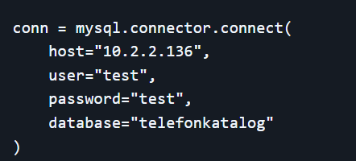

### Installere Ubuntu 
Følg instruksene i denne [videoen](https://www.youtube.com/watch?v=ZWBe2E1Sgi0)
Cd-korte finner du foran rasberry pi’en.
Ps: du trenger ikke å resette pi’en hvis du har allerede installert Ubuntu 

### clone git repo

1. finn fram mappen din i via cmd der du vil overføre git repo'en 
2. cd (mappe navn) for å velge mappe cd .. for å gå tilbake (ls) for å se innhold 
3. skriv git clone og denne url (https://github.com/Eyo007/Den.git)

så er du ferdig

#### koble til pi'en via pc 
1. ssh username@ip 
ps : bytt bruker navn med maskin navn og ip med ip til rasberry pi'en

### oppdater python 
 1. oppdater denne dele av koden din med det som passer for din bruker
 
 

 ### kjøre kode på din maskin.
 python telefonkatalog-2.py